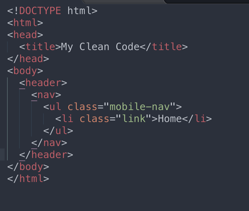
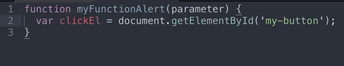
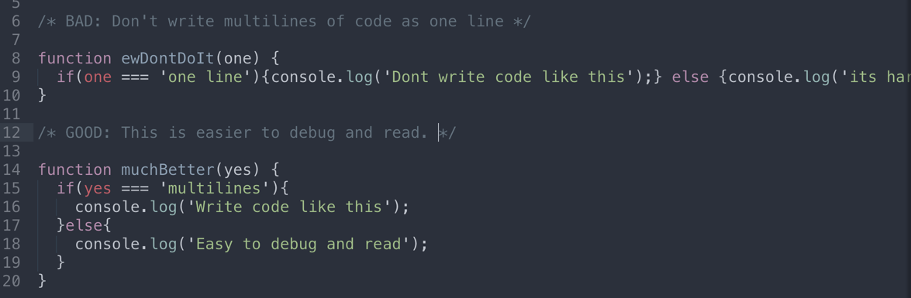

# safe
WHS Safe Final Project

Project Manager: Zak Sakata 
Developers: Zak Sakata, Jomari Jacinto, Zedrick Ara, Talon Navarez, Christian Allen Buco

<h3>Final Project Breakdown</h3>
<b>Assignments and Grading for the 4th quarter</b>
<ul>
  <li>Final project: Minimum of 6 commits a week and Pull request when a task is complete</li>
  <li>Quizzes: Take home quiz every other week</li>
  <li>Research assignments: Given every other week and turned in as a medium blog or Journal entry</li>
</ul>

<h3>Daily Scrum</h3>
<b>Teams will meet daily for the first 5-10 mins of class to report the following:</b>
<ul>
  <li>Progress on their task. What did team members accomplish in the previous class?</li>
  <li>What each team member is going to work for the current class period</li>
  <li>Any road blocks per task or clarifications they may need from other team memebers or instructors</li>
</ul>

<b>Project Manager reports daily to the instructors the following:</b>
<ul>
  <li>Progress per task that the group is currently working on</li>
  <li>Projection as to what will be accomplished by the end of the week</li>
  <li>Any road blocks per task or clarifications the team may need</li>
</ul>

<b>Developers are to notify the project manager and an instructor (in person or in Slack) when:</b>
<ul>
  <li>A task is complete</li>
  <li>A pull request is made</li>
</ul>

If there are questions about a task, code questions, road blocks (challenges) please notify an instructor via Slack.

<h3>Formatting Structure</h3>

<b>HTML, CSS, and Project Images</b>
<ul>
  <li>File, class and id names should be all lowercase with dashes for spacing (if needed).</li>
  <li>Any nesting must be properly tabbed, and every element should be returned as a new line.</li>
</ul>

<b>Javascript</b>
<ul>
  <li>Function names and variables should be camelcase.</li>
  <li>Any nesting must be properly tabbed. No one liners for multiple lines of code.</li>
  <li>Use block comment for each a task.</li>
  <li>Each Javascript task should have a block comment of psuedo code.</li>
</ul>

<b>Formatting example</b>

<b>Sublime Text</b>
<ul>
  <li>Set spaces: 2</li>
</ul>

<b>Git Flow</b>

<b>Github Commit Messages</b>
<ul>
  <li>What was completed, any current bugs.</li>
  <li>Example: ‘completed top navigation in html, links do not work yet’</li>
</ul>

<h2>Task Breakdown - Part 1</h2>

<b>Creating the Views</b>
<ul>
  <li>Follow the design views found under the Assets folder.</li>
  <li>If the view is not the home (first page/index.html), create a new file in the root folder with the view name.</li>
</ul>

<b>Adding CSS</b>
<ul>
  <li>All of the css will be in the css/styles.css</li>
  <li>Assign classes to reusable styles.</li>
  <li>Create a block comment if styles are for a specific view or user interaction, otherwise it's considered a general style.</li>
</ul>
<ul>
  <li><b>Colors</b><ul>
    <li>Red: #D0011B</li>
    <li>Light Gray: #EDEDED</li>
    <li>Dark Gray: #838383</li>
  </ul></li>
  <li><b>Fonts</b><ul>
    <li>Logo <a href="https://fonts.google.com/specimen/Orbitron">Orbitron</a></li>
    <li>Headings <a href="https://fonts.google.com/specimen/Raleway">Raleway Regular</a></li>
    <li>Body <a href="https://fonts.google.com/specimen/Lato">Lato Regular</a></li>
  </ul></li>
</ul>

<b>User Interactions</b>
<ul>
  <li>All of the javascript will be in the js/app.js</li>
  <li>Start each task with a block comment and include your pseudo code.</li>
  <li>Create array objects of mock data per page and store them in a variable</li>
  <li>Dynamically display mock data per view.</li>
  <li>Sort - display data based on a keyword. Make the first items data show as default.</li>
  <li>Create interactive buttons for the top navigation</li>
</ul>

<h2>Task Breakdown - part 2</h2>
<ul>
  <li>Create class for remove animation</li>
  <li>When an item is down voted more than a certain number, add class to 'remove' item</li>
  <li>Create overlay side menu</li>
</ul>

<h2>Stretch Goals</h2>
<ul>
  <li>Make actual forms but do not send data.</li>
  <li>Make comment area</li>
  <li>Make comment area reveal or hide on click</li>
  <li>Have Say Something form save to 'local storage' and display on topic page.</li>
  <li>SUPER STRETCH GOAL: Connect Say Something to SMS API</li>
</ul>

<h2>After review: 4/13</h2>
<b>To Do</b>
<ul>
  <li>One more view: single-topic page</li>
  <li>Reveal comments</li>
  <li>Voting system</li>
  <li>Displaying data dynamically</li>
  <li>Display temp data using submit form and Local Storage</li>
  <li>Move header into body tag and nav button into header</li>
  <li>Optimize css into general.css - link to all pages</li>
  <li>Combine classes with same styles into general. <ul>
    <li>Example: #most-recent, #all-topics{...}</li>
  </ul></li>
  <li>Added down arrow</li>
</ul>
<h1>Nice job. Keep communication open and fair. Awesome job collaborating so far.</h1>
<b>Improvments</b>
<ul>
  <li>Zak: bruh delegate and pair program from now on. Make comments where code can be improved. Little coding from here on out. Time to just navigate. Also research Local Storage. We will be doing a intro lesson a week from now.</li>
  <li>Jomari and Zedrick: psuedo code the logic in app.js for the comment reveal. What's the plan/logic? How will you impliment it?</li>
  <li>Christian: psuedo code the logic for voting system. What's the plan/logic? How will you impliment it?</li>
  <li>Talon: create the styles for the voting system. Animation for removing an entry and create the mock data objects array in js.</li>
</ul>